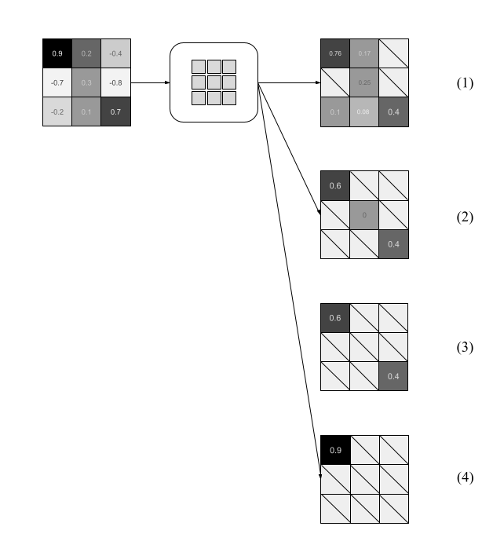

# DeepLearningFinalProject

# Window-Based Activation Functions

## Introduction
Deep learning draws analogies from the  human brain. One important analogy is how  neurons  transmit  information.   Biologically,  neurons transmit electric pulses through  “synapses”  between  adjacent  cells.

An  electric pulse will only be forwarded by a neuron  if  the  voltage on the receiving neuron  reaches  a  threshold  voltage,  called  “action  potential”.   Neurons  are  interconnected, and  multiple  neural  paths  can  converge  into  a single post-synaptic  neuron’s  action  potential.
This is a direct analogy with how deep learning models use a similar neuron model to transmit information, and use activation functions to determine relevant data. Perhaps the most common and simplest activation function is ReLU.  Due to its effectiveness, a lot of activation functions have been modeled after ReLU, essentially becoming fine-tuned variations of it (LeakyReLU, GELU, etc.).

We believe it’s a good idea to branch off from the element-wise implementation of activation functions; drawing inspiration from the brain, we present a set of window-based activation functions, which aim to resemble some of the biological neural network interactions.

## Technical Approach
### Window-Based Activation Functions

Generic window-based activation function

An example input patch, and the corresponding outputs for the subset of activation functions: (1) excitator, (2) inhibitor, (3) nelu, and (4) max.

### Datasets

* CIFAR-100
* Tiny ImageNet
* Caltech 101

### Architectures

* Resnet 38 (homegrown)

## Experiments 

### CIFAR-100 ResNet Model

| Activation Function | Test Acc  |  
| --- | --- |
| ReLU |  40.3 |
| LeakyReLU | 39.91 |
| GELU | 41.41 | 
| --- | --- |
| Max | 43.33 |
| Max + ReLU | 42.08 |
| Softmax Threshold | 39.55 |
| NeLU | 40.3 |
| PNeLU | 36.71 |
| Inhibitor | 37.03 |
| Excitator | **47.37** |

### Tiny ImageNet ResNet Model
| Activation Function | Test Acc |
| --- | --- |
| ReLU | 30.74 |
| GeLU | 30.04 | 
| ---  |  ---  |
| Softmax Threshold | 29.35 |
| Inhibitor | 27.28 |
| Excitator | **34.27** |

### Caltech-101 ResNet Model
| Activation Function | Test Acc |
| --- | --- |
| ReLU | 44.32 |
| LeakyReLU | 46.16 |
| GeLU | 41.17 | 
| ---  |  ---  |
| Max | 37.79 |
| Max + ReLU | 41.17 |
| Softmax Threshold | 46.62 |
| NeLU | 38.33 |
| PNeLU | **47.77** | 
| Inhibitor | 42.70 |
| Excitator | **47.47** |

## Run Time

Dataset: Caltech-101

Model: ResNet 38 (ish)

GPU: Tesla V100

Batch size: 64

Batches per Epoch: 95

Image size: 64x64

| Activation | Epoch Time | Forward Iterations per Second |
| --- | --- | --- |
| ReLU | 4.45s | 57.3 | 
| LeakyReLU | 3.77s | 73.3 |
| GeLU | 3.78s | 72.81 |
| --- | --- | --- | 
| Max | 5.76s | 50.8 |
| Max + ReLU | 6.53s | 46.13 |
| Softmax Threshold | 6.26s | 40.39 |
| NeLU | 6.1s | 41.41 |
| PNeLU | 6.42s | 37.05 |
| Inhibitor | 9.18s | 25.41 |
| Excitator | 10.01s | 25.21 |

* Signficant slow downs for window-based operations. Could be optimized further!

